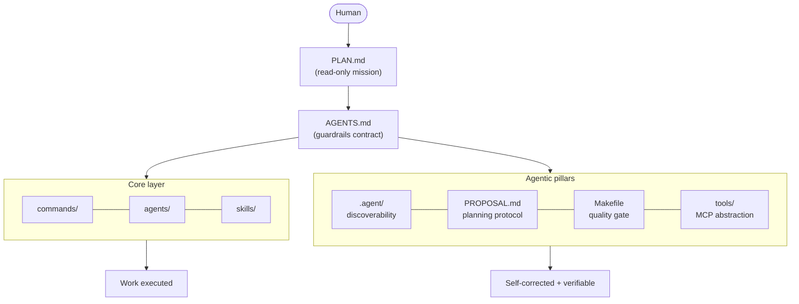
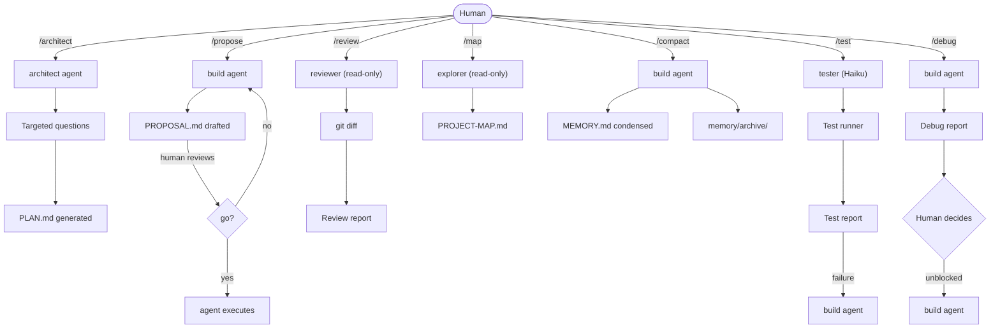
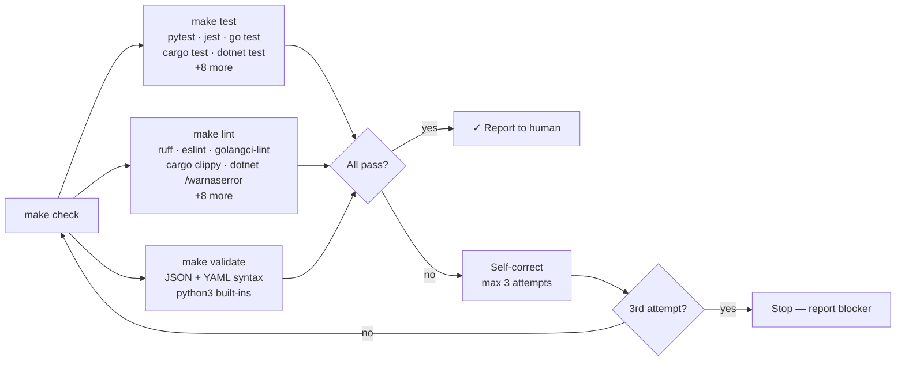
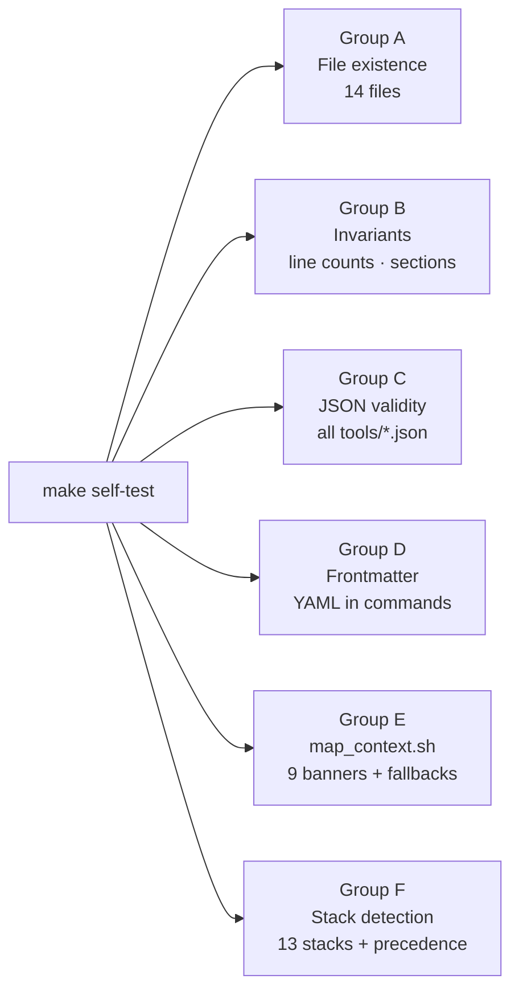

# opencode-starter

> A pragmatic, opinionated starter kit for [OpenCode](https://opencode.ai) + [GitHub Copilot Premium](https://github.com/features/copilot).

**One branch. One mission. One clean context.**

---

## What is this?

A minimal system that makes AI agents actually useful on real projects — not toy demos.

Built from field experience. Not theory.

---

## Core idea

```
Human approves PLAN.md → Agent does everything else
```

Draft it with `/architect`, or write it yourself — see [docs/WRITING-YOUR-PLAN.md](docs/WRITING-YOUR-PLAN.md).
The rest is guardrails and memory hygiene.

---

## Architecture overview



---

## Session flow


---

## Command and agent interactions



---

## Quality gate — `make check`

The Makefile gives every agent a uniform quality gate regardless of project language.
Auto-detects stack from manifest file at project root.





**Supported stacks:** python · node (JS/TS) · go · rust · dotnet (C#) · java-maven · java-gradle · cmake (C/C++) · php · swift · ruby · terraform · helm

---

## Memory lifecycle


---

## Get started

### New to OpenCode + GitHub Copilot?

**Step 1 — Install the tools**

```bash
# Install OpenCode
npm install -g opencode-ai

# GitHub Copilot Premium: activate at github.com/features/copilot
# Then authenticate OpenCode with your GitHub account
opencode auth github
```

**Step 2 — Copy the starter into your project**

```bash
git clone https://github.com/[your-username]/opencode-starter .opencode-starter
cp .opencode-starter/templates/PLAN.md ./PLAN.md
cp -r .opencode-starter/.opencode ./.opencode
```

**Step 3 — Write your first PLAN.md**

Don't start with a blank file. Pick an example from [docs/USE-CASES.md](docs/USE-CASES.md), copy the block, and fill in your values. Takes 5 minutes.

See [docs/WRITING-YOUR-PLAN.md](docs/WRITING-YOUR-PLAN.md) for the full guide.

**Step 4 — Start your first session**

```bash
opencode
```

Type `/onboard` — the agent asks 8 calibration questions and creates your developer profile. This runs once, then every session starts directly from your `PLAN.md`.

---

### Already know the stack?

```bash
# 1. Copy this repo into your project
git clone https://github.com/[your-username]/opencode-starter .opencode-starter

# 2. Copy the templates you need
cp .opencode-starter/templates/PLAN.md ./PLAN.md
cp -r .opencode-starter/.opencode ./.opencode

# 3. Write your PLAN.md, open OpenCode, type /onboard
opencode
```

---

## Structure

```
opencode-starter/
│
├── AGENTS.md              ← Agent instructions (120 lines max)
├── ONBOARD.md             ← First-run setup
│
├── templates/             ← Copy these into your project
│   ├── PLAN.md            ← Human approves this. Read-only for agent.
│   ├── PROPOSAL.md        ← Agent drafts with /propose. Human approves.
│   ├── MEMORY.md          ← Agent manages this
│   ├── BACKLOG.md         ← Agent manages this
│   ├── HUMAN.md           ← Your action items, surfaced by agent
│   ├── DEPENDENCIES.md    ← Verified at every session start
│   ├── CLOUD-RESOURCES.md ← Lab vs prod safety map
│   └── DEVELOPER-PROFILE.md ← Your personal calibration
│
├── .opencode/
│   ├── commands/          ← Slash commands
│   │   ├── onboard.md     ← /onboard
│   │   ├── architect.md   ← /architect
│   │   ├── propose.md     ← /propose
│   │   ├── map.md         ← /map
│   │   ├── compact.md     ← /compact
│   │   ├── review.md      ← /review
│   │   ├── test.md        ← /test
│   │   └── debug.md       ← /debug
│   │
│   ├── agents/            ← Specialized sub-agents
│   │   ├── reviewer.md    ← Read-only code reviewer
│   │   ├── tester.md      ← Test writer (Haiku model)
│   │   └── explorer.md    ← Read-only discovery & mapping
│   │
│   └── skills/            ← Domain expertise, loaded on demand
│       ├── azure/SKILL.md
│       ├── openshift/SKILL.md
│       └── terraform/SKILL.md
│
├── .agent/                ← AI-first discoverability (Pillar 1)
│   ├── AGENT_GUIDE.md     ← Machine-readable session index (YAML)
│   └── map_context.sh     ← Compressed context snapshot
│
├── Makefile               ← Quality gate: test/lint/format/validate/check/self-test
├── make.ps1               ← Same targets for Windows 10/11 (PowerShell)
│
├── tools/                 ← MCP-compatible tool definitions (Pillar 4)
│   ├── tools-manifest.json
│   ├── run-tests.json
│   ├── run-lint.json
│   ├── run-format.json    ← write_gate: true
│   ├── generate-map.json
│   ├── scan-security.json
│   └── git-review.json
│
├── tests/
│   └── run.sh             ← Self-test suite (69 tests, zero dependencies)
│
├── memory/                ← Local only, git-ignored
└── docs/
    ├── PHILOSOPHY.md
    ├── CUSTOMIZE.md
    ├── PILLARS.md         ← Full 4-pillar documentation
    ├── USE-CASES.md
    └── ADVANCED.md
```

---

## Agentic Pillars

Four capability layers extending the base system. Full docs → [docs/PILLARS.md](docs/PILLARS.md)

| # | Pillar | Location | What it adds |
|---|--------|----------|--------------|
| 1 | AI-First Discoverability | `.agent/` | YAML session index + compressed snapshot script |
| 2 | Planning Protocol | `templates/PROPOSAL.md` + `/propose` | Agent-authored proposals, human-approved before execution |
| 3 | Self-Correction Loop | `Makefile` / `make.ps1` | 13-stack quality gate: test · lint · format · validate · check |
| 4 | Tool Abstraction | `tools/` | JSON Schema definitions + MCP-compatible manifest |

---

## Slash commands

| Command | What it does |
|---------|-------------|
| `/onboard` | First-run profile setup. Skips if profile exists. |
| `/architect` | Generate PLAN.md from a rough intent — targeted questions, section-by-section approval. |
| `/propose` | Draft PROPOSAL.md before a major change — present to human, execute only after "go". |
| `/map` | Map the project scoped to PLAN.md. Updates PROJECT-MAP.md. |
| `/compact` | Summarize and archive memory when it gets heavy. |
| `/review` | Trigger reviewer agent on modified files. |
| `/test` | Trigger tester agent, run tests, get report. |
| `/debug` | Diagnose a blocked agent — surfaces contradictions and the human decision needed to unblock. |

---

## Sub-agents

| Agent | Role | Model |
|-------|------|-------|
| `@reviewer` | Code review — read-only, never modifies | Sonnet |
| `@tester` | Tests only — never writes functional code | Haiku |
| `@explorer` | Discovery & mapping — read-only | Sonnet |

**Hard rule on tests:** `@tester` writes tests. `@build` writes code. Never together.
A test is never modified to make it pass. Root cause is reported to human.

---

## Makefile quick reference

| Target | Description | Write? |
|--------|-------------|--------|
| `make test` | Run the project test suite | No |
| `make lint` | Run the linter | No |
| `make format` | Auto-format source code | **Yes — requires "go"** |
| `make validate` | Validate JSON + YAML syntax | No |
| `make check` | test + lint + validate (all independent) | No |
| `make map` | Generate compressed context snapshot | No |
| `make self-test` | Run the starter's own 69-test suite | No |
| `make help` | List targets + detected stack | No |

Windows: use `.\make.ps1 <target>` instead (PowerShell, no WSL required for most targets).

---

## Absolute rules

- `PLAN.md` — Read-only. Always. Conflict → flag to human.
- Destructive commands → Show command + target + env + impact. Wait for **"go"**.
- `memory/` → Agent-only. Human doesn't touch it.
- Tests → Never modified to pass. Root cause always reported.
- Changes touching > 3 files or with regression risk → run `/propose` first.

---

## Security

**Run agents with the minimum permissions needed for the task.**

- Use a dedicated service account or sandbox identity — never your personal admin credentials
- In cloud environments: scope IAM/RBAC roles to the target resource group or namespace only
- The agent will always ask for **"go"** before any write operation — never bypass this
- For production access: use read-only credentials by default; grant write only for the specific operation

> This project follows the **read-free / write-gate** principle: read operations run freely, write operations always require explicit human approval.
> See [GUARDRAILS.md](https://guardrails.md/) and the [AGENTS.md standard](https://github.com/agentsmd/agents.md) for the broader conventions this project aligns with.

---

## Customize

See [docs/CUSTOMIZE.md](docs/CUSTOMIZE.md) for the 5-level customization guide.
See [docs/ADVANCED.md](docs/ADVANCED.md) for segmented memory, session versioning, parallel agents, and hooks.

---

## Philosophy

See [docs/PHILOSOPHY.md](docs/PHILOSOPHY.md).

TL;DR: **Keep memory alive.** Memory that grows without control becomes noise.
Create → Enrich → Compact → Archive → Repeat.

---

## Why not LangGraph / CrewAI / framework X?

Those are great for enterprise multi-agent systems.
This is for a solo developer who wants to ship faster without reading 200 pages of docs first.

---

## Built with

- [OpenCode](https://opencode.ai) — AI coding agent built for the terminal
- [GitHub Copilot Premium](https://github.com/features/copilot) — AI pair programmer with advanced models

---

## Contributing

Only field-tested patterns. No theory.
Open an issue with your use case before submitting a PR.

---

## License

MIT
