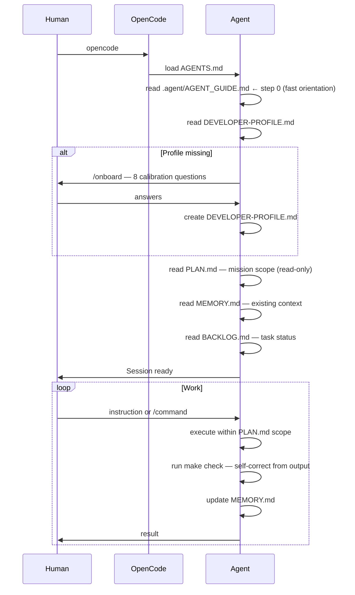
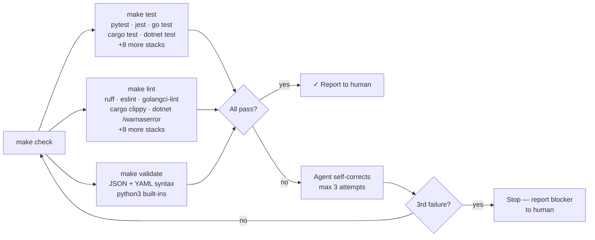
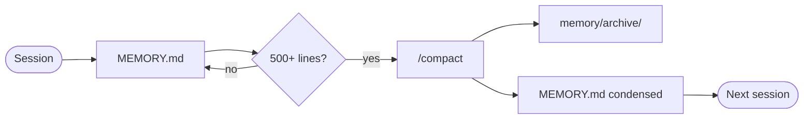

# opencode-starter

> A pragmatic, opinionated starter kit for [OpenCode](https://opencode.ai) + [GitHub Copilot](https://github.com/features/copilot).

**One branch. One mission. One clean context.**

---

## What problem does this solve?

AI coding agents are powerful — but chaotic without structure. Left to their own devices, they:

- Lose context between sessions (forget what was decided, why, and what broke)
- Modify things they shouldn't (tests, PLAN.md, production configs)
- Execute before verifying ("I'll just run `rm -rf` to clean up")
- Drift from the original goal halfway through a session

**opencode-starter is a governance layer**, not a framework. It gives the agent a clear contract:
_human steers, agent executes_ — with guardrails, memory hygiene, and explicit approval gates for anything risky.

No code to install. No dependencies. Copy it, write a PLAN.md, open OpenCode.

---

## Who is this for?

### Solo developers
You want to ship faster without managing the agent manually every step. Write your mission in PLAN.md once. The agent handles execution, memory, and self-correction — you only approve the risky moves.

### Tech leads / teams
You want consistent, auditable AI-assisted work across the team. Every agent session is governed by the same contract (AGENTS.md), follows the same proposal workflow (/propose), and runs the same quality gate (make check).

### First-time users of OpenCode
The starter gives you a working system out of the box. Run `/onboard` first — the agent calibrates to your stack, language preference, and experience level. It takes 5 minutes and you won't need to configure anything else.

---

## Core idea

```
Human approves PLAN.md → Agent does everything else
```

Draft it with `/architect`, or write it yourself — see [docs/WRITING-YOUR-PLAN.md](docs/WRITING-YOUR-PLAN.md).
The rest is guardrails and memory hygiene.

---

## Prerequisites

| Requirement | Why | Install |
|-------------|-----|---------|
| **Node.js ≥ 18** | Required to install OpenCode via npm | [nodejs.org](https://nodejs.org) |
| **OpenCode** | The AI agent runtime this starter is built for | `npm install -g opencode-ai` |
| **GitHub Copilot** | Model provider connected to OpenCode (any active plan) | [github.com/features/copilot](https://github.com/features/copilot) |
| **git** | Session context, diffs, and review commands depend on it | [git-scm.com](https://git-scm.com) |
| **Terminal** | POSIX sh (Linux/macOS) or WSL (Windows 10/11) | WSL: `wsl --install` |
| **python3** | Used by `make validate` and `make self-test` for JSON/YAML parsing | Usually pre-installed on Linux/macOS |

**Windows users:** All Makefile targets work via WSL. For PowerShell without WSL, use `.\make.ps1` instead — same targets, same behavior.

> **Note on GitHub Copilot:** OpenCode connects to GitHub Copilot as its model provider. Any active Copilot plan (Individual, Business, Enterprise) works. Authenticate once with `opencode auth github`.

---

## Architecture overview


---

## Session flow



---

## Command and agent interactions


---

## Quality gate — `make check`

The Makefile gives every agent a uniform quality gate regardless of project language.
Stack is auto-detected from the manifest file at project root (e.g. `package.json`, `go.mod`, `Cargo.toml`…).



**Supported stacks:** python · node (JS/TS) · go · rust · dotnet (C#) · java-maven · java-gradle · cmake (C/C++) · php · swift · ruby · terraform · helm

---

## Memory lifecycle



---

## Get started

### New to OpenCode?

**Step 1 — Install**

```bash
# Install Node.js first if needed: https://nodejs.org
npm install -g opencode-ai

# Connect to GitHub Copilot (browser prompt opens)
opencode auth github
```

**Step 2 — Clone the starter**

```bash
git clone https://github.com/[your-username]/opencode-starter myproject
cd myproject
```

The project already contains `PLAN.md`, `MEMORY.md`, `BACKLOG.md`, and `HUMAN.md` at the root — no file copying needed.

**Step 3 — Write your PLAN.md**

Open `PLAN.md` and replace the content with your mission. Don't start blank — pick an example from [docs/USE-CASES.md](docs/USE-CASES.md) and fill in your values. Takes 5 minutes.

Or let the agent do it: open OpenCode and run `/architect` — it asks targeted questions and writes the plan section by section, waiting for your approval at each step.

See [docs/WRITING-YOUR-PLAN.md](docs/WRITING-YOUR-PLAN.md) for the full guide.

**Step 4 — Start your first session**

```bash
opencode
```

Type `/onboard` — the agent asks 8 calibration questions (stack, language, personality, cloud environment…) and creates your developer profile. This runs once. Every session after that starts directly from your `PLAN.md`.

---

### Already know the stack?

```bash
git clone https://github.com/[your-username]/opencode-starter myproject
cd myproject
# Edit PLAN.md with your mission
opencode
# /onboard on first run, then you're ready
```

---

## Structure

The starter is itself a functioning opencode project. Clone it, edit `PLAN.md`, and start — no file copying needed. The `templates/` directory contains blank copies for when you want to reset or start a sub-mission.

```
opencode-starter/
│
├── AGENTS.md              ← Agent contract (120 lines max, hard limit)
├── PLAN.md                ← Mission — human writes + approves, agent never modifies
├── MEMORY.md              ← Agent-managed session context
├── BACKLOG.md             ← Agent-managed task tracking
├── HUMAN.md               ← Your pending actions, surfaced by agent
├── ONBOARD.md             ← First-run onboarding reference
│
├── templates/             ← Blank copies — use to reset or start a new mission
│   ├── PLAN.md
│   ├── PROPOSAL.md        ← Agent drafts with /propose, human approves
│   ├── MEMORY.md
│   ├── BACKLOG.md
│   ├── HUMAN.md
│   ├── DEPENDENCIES.md    ← Track versions, verified at session start
│   ├── CLOUD-RESOURCES.md ← Lab vs prod safety map
│   └── DEVELOPER-PROFILE.md ← Personal calibration (created by /onboard)
│
├── .opencode/
│   ├── commands/          ← Slash commands (9 total)
│   │   ├── onboard.md     ← /onboard   — first-run profile setup
│   │   ├── architect.md   ← /architect — generate PLAN.md interactively
│   │   ├── propose.md     ← /propose   — draft PROPOSAL.md before big changes
│   │   ├── map.md         ← /map       — map project scoped to PLAN.md
│   │   ├── compact.md     ← /compact   — condense and archive memory
│   │   ├── review.md      ← /review    — code review on modified files
│   │   ├── test.md        ← /test      — run tests, produce report
│   │   ├── debug.md       ← /debug     — diagnose blocked agents
│   │   └── profile.md     ← /profile   — display active config (see Easter eggs)
│   │
│   ├── agents/            ← Specialized sub-agents
│   │   ├── reviewer.md    ← Read-only code reviewer (Sonnet)
│   │   ├── tester.md      ← Test writer only, never functional code (Haiku)
│   │   └── explorer.md    ← Read-only discovery & mapping (Sonnet)
│   │
│   └── skills/            ← Domain expertise loaded on demand
│       ├── azure/SKILL.md
│       ├── openshift/SKILL.md
│       └── terraform/SKILL.md
│
├── .agent/                ← AI-first discoverability (Pillar 1)
│   ├── AGENT_GUIDE.md     ← Machine-readable session index (YAML blocks)
│   └── map_context.sh     ← Compressed context snapshot (~200 lines output)
│
├── Makefile               ← Quality gate: 13-stack auto-detection
├── make.ps1               ← Same targets for Windows 10/11 (PowerShell)
│
├── tools/                 ← MCP-compatible tool definitions (Pillar 4)
│   ├── tools-manifest.json
│   ├── run-tests.json
│   ├── run-lint.json
│   ├── run-format.json    ← write_gate: true (requires "go")
│   ├── generate-map.json
│   ├── scan-security.json
│   └── git-review.json
│
├── tests/
│   └── run.sh             ← Self-test suite (69 tests, zero dependencies)
│
├── memory/                ← Local only — git-ignored
└── docs/
    ├── PHILOSOPHY.md      ← 5 founding principles
    ├── CUSTOMIZE.md       ← 5-level customization guide
    ├── PILLARS.md         ← Full 4-pillar documentation
    ├── USE-CASES.md       ← Ready-to-copy PLAN.md examples
    └── ADVANCED.md        ← Segmented memory, parallel agents, hooks, RAG
```

---

## Agentic Pillars

Four capability layers on top of the base system. Full docs → [docs/PILLARS.md](docs/PILLARS.md)

| # | Pillar | Location | What it adds |
|---|--------|----------|--------------|
| 1 | AI-First Discoverability | `.agent/` | YAML session index + `map_context.sh` for fast orientation |
| 2 | Planning Protocol | `templates/PROPOSAL.md` + `/propose` | Agent drafts proposals, human approves before execution |
| 3 | Self-Correction Loop | `Makefile` / `make.ps1` | 13-stack quality gate: test · lint · format · validate · check |
| 4 | Tool Abstraction | `tools/` | JSON Schema definitions + MCP-compatible manifest (6 tools) |

---

## Slash commands

| Command | What it does |
|---------|-------------|
| `/onboard` | First-run calibration — 8 questions, creates `DEVELOPER-PROFILE.md`. Skips if profile exists. |
| `/architect` | Generate `PLAN.md` interactively — targeted questions, section-by-section approval before writing. |
| `/propose` | Draft `PROPOSAL.md` before a major change. Presents to human, executes only after explicit "go". |
| `/map` | Map the codebase scoped to `PLAN.md`. Creates or updates `PROJECT-MAP.md`. |
| `/compact` | Condense `MEMORY.md` and archive to `memory/archive/` when it exceeds 500 lines. |
| `/review` | Trigger `@reviewer` on files modified since last commit. Returns structured report. |
| `/test` | Trigger `@tester`, run the test suite, return report. Failures go back to `@build`, never modify tests. |
| `/debug` | Diagnose a blocked agent — surfaces the contradiction and the human decision needed to unblock. |

---

## Sub-agents

| Agent | Role | Model | Write? |
|-------|------|-------|--------|
| `@reviewer` | Code review — reads diffs, never modifies | Sonnet | No |
| `@tester` | Writes tests only — never writes functional code | Haiku | Tests only |
| `@explorer` | Discovery & codebase mapping — read-only | Sonnet | No |

**Hard rule:** `@tester` writes tests. `@build` writes code. Never the same agent.
A test is never modified to make it pass — root cause is always reported to the human.

---

## Makefile quick reference

| Target | What it runs | Write? |
|--------|-------------|--------|
| `make test` | Project test suite (auto-detected) | No |
| `make lint` | Linter (auto-detected) | No |
| `make format` | Auto-format source code | **Yes — requires "go"** |
| `make validate` | JSON + YAML syntax check (python3) | No |
| `make check` | test + lint + validate, all independent | No |
| `make map` | Run `.agent/map_context.sh` | No |
| `make self-test` | Starter's own 69-test structural suite | No |
| `make help` | List targets + detected stack | No |

Windows without WSL: `.\make.ps1 <target>` — same targets, PowerShell implementation.

---

## Absolute rules

- `PLAN.md` — Read-only. Always. Agent never modifies it. Conflict → flag to human.
- Changes touching > 3 files or with regression risk → `/propose` first, wait for "go".
- Write operations → Show command + target + environment + impact. Wait for **"go"**.
- `memory/` → Agent-managed. Human doesn't touch it directly.
- Tests → Never modified to make them pass. Root cause always reported.

---

## Easter eggs

Two commands that aren't part of the core workflow — but useful to know.

| Command | What it does |
|---------|-------------|
| `/profile` | Display active developer profile + all configured agents and commands. Quick audit of your setup. |
| `/joke` | One programming/DevOps joke. Dry humor preferred. No explanation after the punchline. |

---

## Security

**Run agents with the minimum permissions needed for the task.**

- Use a dedicated service account or sandbox identity — never your personal admin credentials
- In cloud environments: scope IAM/RBAC roles to the target resource group or namespace only
- The agent always asks for **"go"** before any write operation — never bypass this
- For production access: use read-only credentials by default; grant write only for the specific operation

> This project follows the **read-free / write-gate** principle: read operations run freely, write operations always require explicit human approval.
> See the [AGENTS.md standard](https://github.com/agentsmd/agents.md) for the broader conventions this project aligns with.

---

## Customize

See [docs/CUSTOMIZE.md](docs/CUSTOMIZE.md) for the 5-level customization guide.
See [docs/ADVANCED.md](docs/ADVANCED.md) for segmented memory, session versioning, parallel agents, and hooks.

---

## Philosophy

See [docs/PHILOSOPHY.md](docs/PHILOSOPHY.md).

Five principles: human steers / one branch = one mission / simple first / native OpenCode / keep memory alive.

TL;DR: **Memory that grows without control becomes noise.**
Create → Enrich → Compact → Archive → Repeat.

---

## Why not LangGraph / CrewAI / framework X?

Those are great for enterprise multi-agent orchestration pipelines.
This is for a developer who wants to ship faster without reading 200 pages of docs first.

No dependencies. No installation. No reinvention. Just a contract between you and the agent.

---

## Built with

- [OpenCode](https://opencode.ai) — AI coding agent built for the terminal
- [GitHub Copilot](https://github.com/features/copilot) — model provider, connects via `opencode auth github`

---

## Contributing

Only field-tested patterns. No theory.
Open an issue with your use case before submitting a PR.

---

## License

MIT
